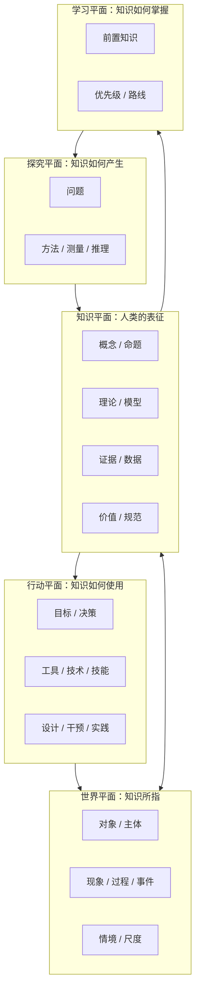
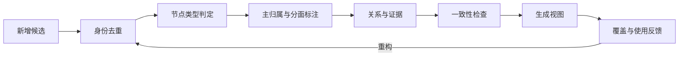

# 总体架构设计

## 1. 设计目标

Human Knowledge Model（HKM）要同时服务五种任务：

1. **定位**：任何重要知识都能找到合理挂载位置；
2. **理解**：看见对象、问题、证据、解释、方法与应用之间的结构；
3. **迁移**：识别跨领域共用的模型与机制；
4. **调用**：从现实问题反向找到应使用的知识；
5. **学习**：依据前置关系、迁移价值和实际用途安排顺序。

“全量”不是收录每个事实，而是使结构具有高覆盖率、明确边界和可无限细化能力。

## 2. 核心架构：五平面、一张图、多种视图



- **五平面**避免把现实对象、知识陈述、研究方法和实际技能混成同类节点。
- **一张图**保证节点身份唯一，关系可以跨平面和跨领域。
- **多种视图**根据用户任务投影出学科树、对象地图、方法地图、学习路线或问题调用图。

## 3. 为什么不是一棵学科树

树只表达一种父子关系，而真实知识至少同时包含：

- 分类关系：鲸是哺乳动物；
- 组成关系：细胞是生物体的一部分；
- 解释关系：进化理论解释适应；
- 证据关系：实验结果支持或削弱命题；
- 因果关系：吸烟增加多种疾病风险；
- 实现关系：算法由软件实现；
- 应用关系：贝叶斯推断应用于诊断；
- 学习关系：概率论是统计推断的重要前置；
- 类比关系：生物网络与通信网络具有部分共同结构。

因此本项目采用：

> **主导航树 + 多重归属 + 类型化关系图 + 多维分面标签**。

主导航树降低人的认知负担；多重归属和关系图纠正树的失真；分面标签支持从问题反向检索。

## 4. 两套正交结构

### 4.1 范围层级（Scope hierarchy）

只有知识范围使用 H 层级：

| 层级 | 含义 | 例子 |
|---|---|---|
| H0 | 全部人类知识 | Human Knowledge |
| H1 | 超级领域 | 自然、生命与心智 |
| H2 | 一级领域 | 生命与进化 |
| H3 | 子领域 | 遗传学、生态学 |
| H4 | 核心主题或问题簇 | 遗传与变异、种群动态 |

H 层级描述“讨论范围变窄”，不描述知识成熟度，也不把概念、理论、模型、方法、工具机械排成深度。

### 4.2 内容类型（Knowledge artifact types）

在任意 H3/H4 范围内都可以出现：

```text
问题 → 观察/数据 → 命题/规律 → 理论/模型
                          ↘ 方法 → 工具/技术 → 实践/应用
价值/规范 ───────────────────────────────↗
```

例如“供给与需求”可建模为概念簇、模型和解释框架；“回归分析”是方法；“R”是工具；“最低工资影响评估”是问题/应用。它们不应该仅因具体程度不同而被放进固定相邻层级。

## 5. 一级领域的设计逻辑

一级领域不是按大学院系直接复制，而是由四个因素共同决定：

```text
领域稳定性 = 核心问题的持续性
           + 研究对象的相对凝聚性
           + 证据/方法传统的可识别性
           + 对个人认知与实践的导航价值
```

本版设置 5 个 H1 超级领域和 20 个 H2 一级领域。H1 是认知导航，不要求严格互斥；H2 提供稳定主归属，同时允许次级归属。

领域边界采用“核心—边缘”结构：

- **核心**：该领域不可删除的核心问题与模型；
- **共享边缘**：与相邻领域共同研究的主题；
- **桥接区**：已经形成稳定跨学科共同体的领域，如认知科学、气候科学、计算生物学；
- **应用区**：从多个基础领域调用知识解决问题的实践，如医学、工程、治理。

## 6. 三种知识组织模式并存

| 组织模式 | 适合做什么 | 局限 |
|---|---|---|
| 层级树 | 概览、浏览、课程路径 | 强迫单一父节点，弱化横向关系 |
| 类型化图 | 解释依赖、证据、因果、迁移 | 大图难以直接阅读 |
| 分面坐标 | 按任务组合与检索 | 依赖一致的元数据 |

项目文件中的 Markdown 主要承载人类可读视图；YAML 承载规范节点和关系；后续可转换为 JSON-LD、RDF/SKOS 或属性图数据库。

## 7. 认识论上的约束

知识库不把“被收录”误写成“为真”。每个重要陈述最终应区分：

- **陈述内容**：主张了什么；
- **证据基础**：由什么观察、数据、推理或传统支持；
- **认识状态**：假说、争议、局部共识、强共识、已弃用；
- **适用范围**：对哪些对象、尺度、条件和时间成立；
- **不确定性**：置信度、误差、替代解释；
- **来源与版本**：谁在何时依据什么作出判断。

规范性知识还必须区分事实判断、价值前提与行动建议，防止从“是什么”无说明地跳到“应该是什么”。

## 8. 从问题到知识调用

问题不是领域树末端，而是图中的一等节点。一个问题通过以下字段路由：

```text
问题意图：描述 / 解释 / 预测 / 诊断 / 评价 / 设计 / 优化 / 决策
对象：物理系统 / 生命 / 人 / 组织 / 制度 / 技术 / 文化……
尺度：微观 / 个体 / 群体 / 组织 / 社会 / 地球 / 宇宙
时间：瞬时 / 短期 / 长期 / 历史 / 演化
约束：资源 / 信息 / 能量 / 法律 / 伦理 / 风险
证据要求：观察 / 实验 / 统计 / 历史 / 仿真 / 专家实践
```

系统据此检索相关领域、通用模型、方法、案例和边界条件，而不是只做关键词匹配。

## 9. 数据与文档的职责

| 载体 | 规范性 | 用途 |
|---|---|---|
| `08-data/*.yaml` | 高 | 稳定 ID、字段、节点与关系的机器真源 |
| `00-meta/*.md` | 高 | 设计规则、语义、审计标准 |
| `01-knowledge-map/*.md` | 中 | 面向人的导航投影与解释 |
| 后续领域文档 | 中 | 领域骨架、案例和学习说明 |
| 可视化 | 低（派生） | 从数据生成，不作为唯一真源 |

当文档与数据冲突时，先判断是语义规则还是实例错误：语义以 `00-meta` 为准，节点 ID 和边实例以 `08-data` 为准，然后同步修复派生视图。

## 10. 演化策略



允许重构标签、主归属和导航；稳定 ID 不随文件名或显示名称变化。废弃节点不直接删除，而是标注 `deprecated` 并通过 `replaced-by` 指向新节点，以保留历史与外部链接。

## 11. 当前边界

v0.1 已解决总体结构和一级领域入口，尚未声称：

- 已穷尽 H3/H4 子领域；
- 已验证每个领域的 10–30 节点骨架；
- 已给出完整思维模型与通用模型；
- 已构建 Top 50/100/300 学习集；
- 已为所有边附加证据与置信度。

这些是下一阶段的明确工作，而不是被“一级地图看起来完整”所掩盖的内容。
