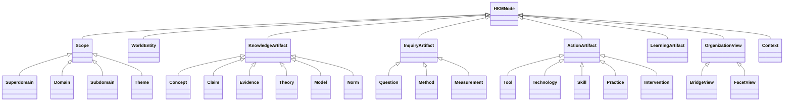

# Human Knowledge Ontology v0.1

## 1. 语义承诺

本体把 HKM 定义为**带来源和语境的类型化属性图**：

```text
Graph = (Nodes, Edges, Facets, Provenance, Versions)
```

- 节点表示可复用身份，不等于一个 Markdown 文件；
- 边表示有方向和语义的断言，不等于“二者相关”；
- 分面描述节点在特定观察轴上的位置；
- 来源说明断言从哪里来；
- 版本记录知识状态和结构如何变化。

图采用开放世界假设：未记录某条关系不表示关系不存在；但每条已记录关系必须满足类型和方向约束。

## 2. 顶层类



## 3. 节点类型

### 3.1 范围与导航

| 类型 | 定义 | 判定测试 |
|---|---|---|
| `corpus` | 全知识库根节点 | 是否包含所有范围？ |
| `superdomain` | 认知导航用的最大知识家族 | 是否把若干一级领域按共同认识功能聚合？ |
| `domain` | 稳定的一级知识入口 | 是否有持久核心问题、对象/方法传统和独立导航价值？ |
| `subdomain` | 领域内相对稳定的研究或实践范围 | 是否能形成可识别的共同体或课程/实践序列？ |
| `theme` | 围绕一组紧密问题组织的范围 | 是否比子领域更依赖具体问题，而非制度化学科身份？ |

`bridge-view` 与 `facet-view` 是**组织视图**而非 Scope。它们不占 H0–H4 的某一层，也不与领域竞争主归属：

| 类型 | 定义 | 判定测试 |
|---|---|---|
| `bridge-view` | 围绕稳定跨域问题或机制组织多个范围节点的可计算视图 | 是否必须同时调用三个以上 H2，且拆回单域会丢失核心解释或行动链？ |
| `facet-view` | 沿对象、目的、方法、尺度、情境或学习价值重排节点的视图 | 是否只是同一图谱的另一观察轴，而非新的知识范围？ |

桥接视图通过 `member-of` 收纳 H3，通过 `bridges` 指向所连接的 H2。成员关系表示导航集合，不推出成员之间存在 `is-a`、`part-of` 或概念等价关系。

### 3.2 世界平面

| 类型 | 定义 | 例子 |
|---|---|---|
| `entity-type` | 现实或设想对象的类别 | 原子、物种、组织、国家 |
| `system` | 有边界、组成和相互作用的整体 | 生态系统、市场、神经系统 |
| `agent` | 能感知、选择或行动的主体 | 人、组织、政府、AI agent |
| `phenomenon` | 可观察或推定发生的现象/过程 | 扩散、通胀、学习、衰老 |
| `event` | 特定时间情境中的发生 | 一次实验、战争、政策实施 |
| `artifact` | 人为创造的对象或符号产品 | 桥梁、法律文本、乐曲、软件 |
| `resource` | 在行动中受约束、分配或转换的量 | 能量、时间、资本、注意力 |

### 3.3 知识平面

| 类型 | 定义 | 与相邻类型的边界 |
|---|---|---|
| `concept` | 用来区分、组织经验的意义单位 | 不自动主张世界确实如此 |
| `claim` | 可被支持、质疑或限定的陈述 | 必须允许认识状态和适用范围 |
| `observation` | 在特定程序和情境下的记录 | 是证据候选，不自动等于事实 |
| `evidence` | 被用于支持或挑战某主张的材料 | “证据”是相对于主张的角色 |
| `law-principle` | 高度概括的规律、定律或原则 | 可为经验性、形式性或规范性 |
| `theory` | 组织概念和主张以解释一类现象的体系 | 通常比模型覆盖范围广 |
| `model` | 为特定目的保留部分结构的表征 | 必须声明目的、假设、变量和边界 |
| `framework` | 组织问题或分析维度的结构 | 不一定给出可检验预测 |
| `norm-value` | 关于价值、义务、标准或偏好的内容 | 与经验描述显式分离 |
| `case` | 有学习或比较价值的具体实例 | 不因生动而自动具备普遍性 |

### 3.4 探究、行动与学习平面

| 类型 | 定义 | 例子 |
|---|---|---|
| `question` | 有待回答、诊断、设计或决定的问题 | 因果问题、预测问题、规范问题 |
| `method` | 产生、检验或应用知识的可复用程序 | 随机试验、民族志、动态规划 |
| `measurement` | 将概念操作化并获得观测值的规则 | 量表、传感协议、指标 |
| `tool` | 执行方法或工作的具体手段 | 显微镜、编程语言、问卷 |
| `technology` | 为目的整合原理、方法和工件的系统 | 电网、疫苗平台、数据库 |
| `skill` | 需要练习形成的可表现能力 | 写作、诊断、焊接、谈判 |
| `practice` | 社会化、反复执行的活动体系 | 临床实践、审计、教学 |
| `intervention` | 为改变系统状态而采取的行动 | 政策、治疗、组织变革 |
| `problem-template` | 可跨案例复用的问题结构 | 资源分配、故障诊断、机制设计 |
| `learning-unit` | 面向学习者组织的教学单元 | 模块、练习、项目 |
| `learning-path` | 由前置和目标约束组成的学习路线 | 概率思维路线、数据素养路线 |

一个节点可以有多个兼容角色，例如“线性回归”既可作为模型，也可作为估计方法；实现时使用 `primary_type` 加 `additional_types`，而不是复制两个身份。

## 4. 关系类型

### 4.1 严格结构关系

| 关系 | 方向 | 语义 | 主要约束 |
|---|---|---|---|
| `narrower-than` | 窄 → 广 | 范围更专门 | 仅 Scope；不可成环；可传递推理 |
| `instance-of` | 实例 → 类 | 某对象是某类的实例 | 不等同于范围父子 |
| `is-a` | 子类 → 父类 | 所有子类成员均为父类成员 | 需要可替换性测试；可传递 |
| `part-of` | 部分 → 整体 | 组成而非分类 | 不与 `is-a` 混用；传递性依语境 |
| `member-of` | 成员 → 集合 | 归入集合但非组成结构 | 不推出其他成员属性 |
| `in-scope` | 内容节点 → Scope | 内容落在某领域、子领域或主题的范围内 | 可多值；不表示范围父子 |
| `primary-domain` | 节点 → Domain | 主导航归属 | 每版本恰好一个，元节点除外 |
| `in-domain` | 节点 → Domain | 次级领域归属 | 可以有多个 |

### 4.2 认识与证据关系

| 关系 | 方向 | 含义 |
|---|---|---|
| `defines` | 表述 → 概念 | 给出操作性或理论定义 |
| `operationalizes` | 测量/方法 → 概念 | 把抽象概念变成可观察程序 |
| `measures` | 测量/工具 → 属性 | 获取某属性的观测 |
| `supports` | 证据/推理 → 主张 | 提高主张可信度 |
| `challenges` | 证据/论证 → 主张 | 降低或限制主张可信度 |
| `contradicts` | 主张 → 主张 | 在相同解释和语境下不能同时成立 |
| `explains` | 理论/模型 → 现象/主张 | 提供机制或统一解释 |
| `predicts` | 模型/理论 → 结果 | 产生可比较预测 |
| `assumes` | 模型/论证 → 主张 | 结论成立所依赖的前提 |
| `derived-from` | 结论/模型 → 来源 | 通过推理、变换或历史发展得到 |
| `generalizes` | 广模型 → 窄模型 | 前者包含后者为特例 |
| `refines` | 新表征 → 旧表征 | 增加精度、机制或适用区分 |

### 4.3 因果、功能与行动关系

| 关系 | 方向 | 含义 |
|---|---|---|
| `causes` | 原因 → 结果 | 在声明语境下有因果贡献 |
| `influences` | 因素 → 结果 | 方向存在但机制/充分性未完全指定 |
| `mediates` | 中介 → 因果路径 | 解释原因如何影响结果 |
| `moderates` | 条件 → 关系 | 改变另一关系的大小或方向 |
| `constrains` | 约束 → 系统/行动 | 限制可行状态或方案 |
| `enables` | 条件/技术 → 能力 | 使某行为或结果成为可能 |
| `uses` | 方法/实践 → 资源 | 在执行中调用 |
| `implements` | 工具/技术 → 方法/模型 | 提供具体实现 |
| `applies-to` | 知识/方法 → 对象/问题 | 在给定条件下可使用 |
| `produces` | 过程/方法 → 产物 | 生成数据、工件或状态 |
| `transforms` | 行动/过程 → 系统 | 改变状态或结构 |

### 4.4 集成与学习关系

| 关系 | 方向 | 含义 |
|---|---|---|
| `depends-on` | 节点 → 节点 | 逻辑、机制、数据或实践依赖 |
| `complements` | A ↔ B | 合用时覆盖互补盲区；对称 |
| `analogous-to` | A ↔ B | 结构部分相似；必须声明对应和断裂处 |
| `bridges` | 桥接节点 → 多领域 | 提供稳定跨领域连接 |
| `prerequisite-of` | 前置 → 后继 | 对目标掌握水平而言应先学习 |
| `recommended-before` | A → B | 有帮助但非严格必要 |
| `transfer-to` | 模型/技能 → 新语境 | 可迁移并声明变换条件 |
| `replaced-by` | 旧节点 → 新节点 | 版本迁移；旧 ID 保留 |

## 5. 边属性

每条重要边至少支持：

```yaml
id: rel.example
source: node.a
type: explains
target: node.b
scope: "在哪些对象、时间、尺度或假设下成立"
confidence: high        # high | medium | low | contested
epistemic_status: accepted
provenance:
  - source-id
valid_from: null
valid_to: null
notes: null
```

`causes`、`supports`、`contradicts` 等强语义关系如果没有语境与来源，不应退化为无说明的事实。领域层面的种子关系可暂标为 `curatorial`，后续在概念层细化和取证。

## 6. 分面（Facets）

分面不是父子层级。首版使用十组：

1. `object`：研究对象；
2. `aim`：描述、解释、预测、诊断、评价、设计、控制、优化、决策、创造；
3. `epistemic_mode`：经验、形式、解释、诠释、规范、设计、具身实践；
4. `method`：观察、实验、演绎、统计、仿真、历史比较、解释学、设计迭代等；
5. `scale`：微观到宇宙、瞬时到演化；
6. `context`：时间、地点、制度、文化与环境；
7. `uncertainty`：随机性、认识不足、模型不确定性、深度不确定性；
8. `application`：健康、生产、治理、沟通、安全、生活等；
9. `epistemic_status`：假说、争议、局部共识、强共识、已弃用；
10. `learning`：难度、前置、优先级、迁移价值。

## 7. 身份与命名

稳定 ID 采用：

```text
hkm:<type>:<ascii-slug>
```

例：`hkm:domain:life-evolution`。规则：

- ID 与中英文显示名称分离；
- 改名不改 ID；
- 同义词放入 `aliases`；
- 同一概念跨领域复用一个 ID；
- 真正不同的意义使用不同 ID，并通过 `related` 或映射关系连接；
- 合并/拆分保留旧 ID，并通过 `replaced-by` 迁移。

## 8. 与 SKOS / RDF / 属性图的兼容

可映射关系：

| HKM | SKOS/RDF 近似 |
|---|---|
| `narrower-than` | `skos:broader`（方向需转换） |
| 显示名称/别名 | `skos:prefLabel` / `skos:altLabel` |
| 定义/范围注记 | `skos:definition` / `skos:scopeNote` |
| 宽泛关联 | `skos:related` |
| `is-a` | `rdfs:subClassOf` |
| `instance-of` | `rdf:type` |

SKOS 适合发布概念方案，但其 `broader/narrower/related` 不足以表达因果、证据、实现和学习依赖，所以 HKM 保留更丰富的边类型。

## 9. 最小一致性规则

1. Scope 的 `narrower-than` 图必须无环；
2. `is-a` 与 `part-of` 不可互换；
3. `primary-domain` 每版本至多一个；
4. 对称关系只存一条规范边或生成逆边，不重复制造两个事实；
5. `contradicts` 只有在解释、时间、尺度一致时使用，否则用 `challenges`；
6. `causes` 必须有 `scope`，概念层边最终应有来源；
7. 学习前置关系相对于目标熟练度，不宣称绝对顺序；
8. 分面值不作为隐式父子关系；
9. 节点弃用不删除身份；
10. 每个 H2 领域必须声明边界、桥接领域和至少一个跨域关系。
