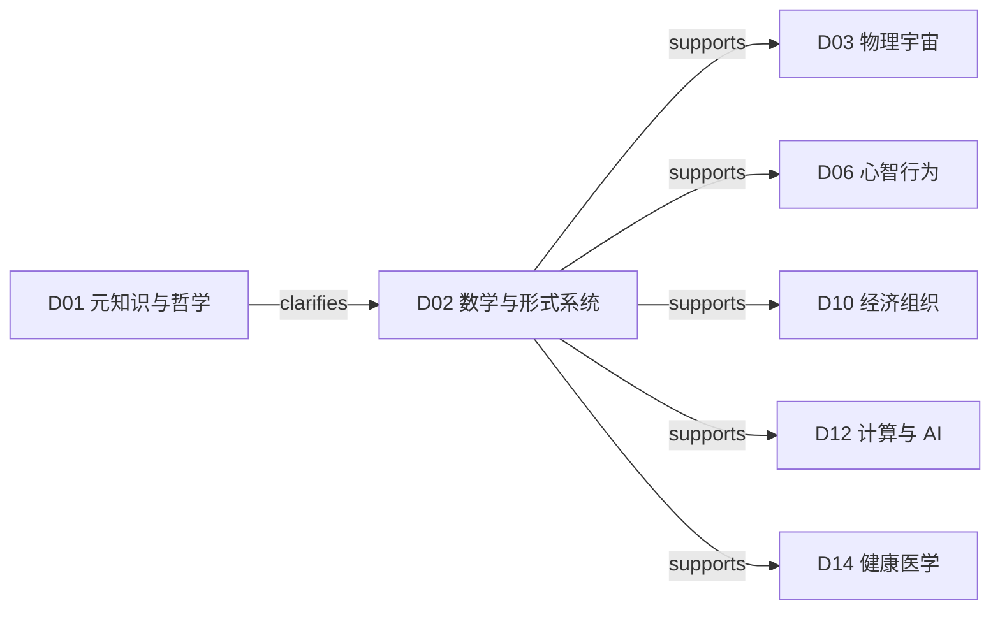
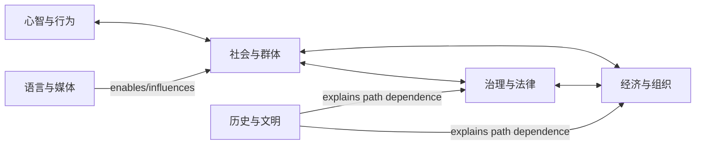
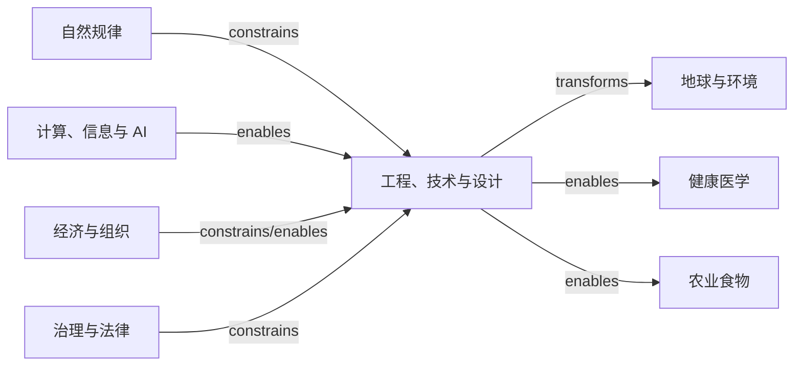
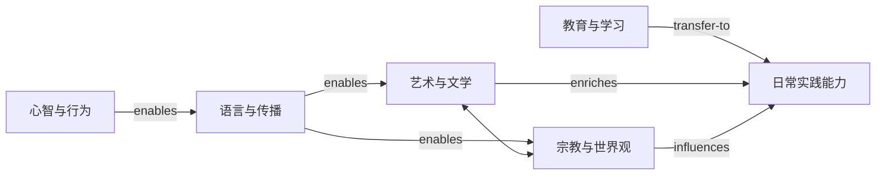

# 一级领域关系

## 1. 关系地图不是相关词云

本文件只放会改变理解或知识调用的结构性关系。H2 领域本身是宽范围，因此边表示“典型且持续的结构联系”，不是领域中每个节点都服从该关系。精确断言应在 H3/H4 和概念层展开并附适用语境。

## 2. 五条主链

### 表征与推断链

`clarifies` 在数据中细化为 `complements/depends-on` 等规范关系；图中仅作人类可读标签。

### 自然层级与涌现链

这不是把高层现象“还原为”低层：下层提供条件和约束，高层仍可能有不可省略的组织、信息、历史和意义结构。

### 人类制度链

### 知识到人造世界链

### 意义与能力链

`enriches` 最终需按具体内容拆为 `influences`、`applies-to` 或 `transfer-to`。

## 3. 关键桥接节点候选

| 桥接模型/概念 | 来源/主归 | 典型去向 | 连接机制 |
|---|---|---|---|
| 因果 | D01/D02 | 自然、生命、社会、医学、政策 | 区分相关、干预、机制与反事实 |
| 概率与不确定性 | D02 | 科学、金融、医学、安全、决策 | 表示未知、变异、风险和更新 |
| 信息 | D02/D12 | 物理、生命、心智、语言、组织 | 编码、约束、传输、控制与学习 |
| 系统与反馈 | 跨域 Universal Model | 生态、工程、经济、组织、治理 | 边界、状态、回路、延迟与稳定性 |
| 网络 | D02/D12 | 生物、社会、市场、交通、媒体 | 关系结构、扩散、中心性与级联 |
| 进化与选择 | D05 | 心智、文化、组织、算法 | 变异、复制/保留、选择、适应 |
| 优化与权衡 | D02 | 工程、经济、生物、管理、个人 | 目标、约束、局部/全局与机会成本 |
| 激励与博弈 | D10/D09 | 生物、组织、政治、安全 | 多主体目标、策略互动与机制设计 |
| 熵/秩序 | D03/D02 | 信息、生命、计算、复杂系统 | 多种正式定义之间需谨慎映射 |
| 学习与适应 | D06/D16 | 生物、AI、组织、个人 | 反馈更新、经验积累与环境响应 |
| 权力与制度 | D07/D09 | 经济、技术、媒体、知识生产 | 规则、资源、合法性和执行能力 |
| 叙事与意义 | D11/D18/D19 | 历史、政治、组织、个人 | 压缩经验、协调身份与塑造行动 |

## 4. 领域邻接表

每个领域列出最需要优先建立精确边的邻域：

| 领域 | 一级邻域 | 首要关系问题 |
|---|---|---|
| D01 | D02/D06/D08/D09/D12/D19 | 认识、推理、价值与世界观的边界 |
| D02 | D03/D05/D06/D10/D12/D13/D14/D17 | 形式结构如何映射现实、何时失真 |
| D03 | D02/D04/D05/D12/D13 | 物理约束、尺度与信息表述 |
| D04 | D03/D05/D09/D10/D13/D15/D17 | 地球耦合、人类压力与风险 |
| D05 | D03/D04/D06/D12/D14/D15 | 生命机制、生态、选择与干预 |
| D06 | D01/D05/D07/D10/D11/D12/D14/D16 | 脑、认知、社会和机器模型的对应 |
| D07 | D06/D08/D09/D10/D11/D14/D16 | 群体机制、文化、制度与不平等 |
| D08 | D01/D07/D09/D10/D11/D13/D19 | 来源、路径依赖与跨时期类比 |
| D09 | D01/D07/D08/D10/D11/D13/D17 | 权力、权利、政策、技术与执行 |
| D10 | D02/D06/D07/D08/D09/D12/D13/D17 | 激励、组织、资源、风险与技术变化 |
| D11 | D06/D07/D08/D09/D12/D18/D19 | 符号、认知、媒介、权力和创造 |
| D12 | D02/D06/D10/D11/D13/D17 | 计算极限、智能、基础设施与治理 |
| D13 | D02/D03/D04/D09/D10/D12/D14/D15/D17/D18 | 需求、约束、全生命周期和外部性 |
| D14 | D02/D05/D06/D07/D09/D10/D13/D15/D20 | 机制、证据、照护、资源与行为 |
| D15 | D04/D05/D10/D13/D14/D17/D20 | 生态、产量、营养、供应和安全 |
| D16 | D01/D06/D07/D09/D11/D12/D20 | 学习机制、课程、制度与能力迁移 |
| D17 | D02/D04/D06/D09/D10/D12/D13/D14 | 威胁、误判、脆弱性、恢复与权衡 |
| D18 | D06/D08/D11/D13/D19/D20 | 感知、形式、媒介、传统与体验 |
| D19 | D01/D06/D07/D08/D11/D18/D20 | 信念、经验、共同体、诠释和生活 |
| D20 | D06/D10/D13/D14/D15/D16/D17/D18/D19 | 专业知识如何转化为安全实际能力 |

## 5. 关系质量规则

- 领域边是“建图提示”，概念边才承担精确知识断言；
- `depends-on` 要说明逻辑、机制、数据还是实践依赖；
- `analogous-to` 必须同时写相似结构与不可类比之处；
- 低层约束不自动消除高层解释；
- 双向影响不等于强度对称；
- 历史顺序不自动等于因果；
- `supports` 不等于证明，`challenges` 不等于彻底否定；
- 每条强关系在后续版本都应附来源、语境与置信度。
