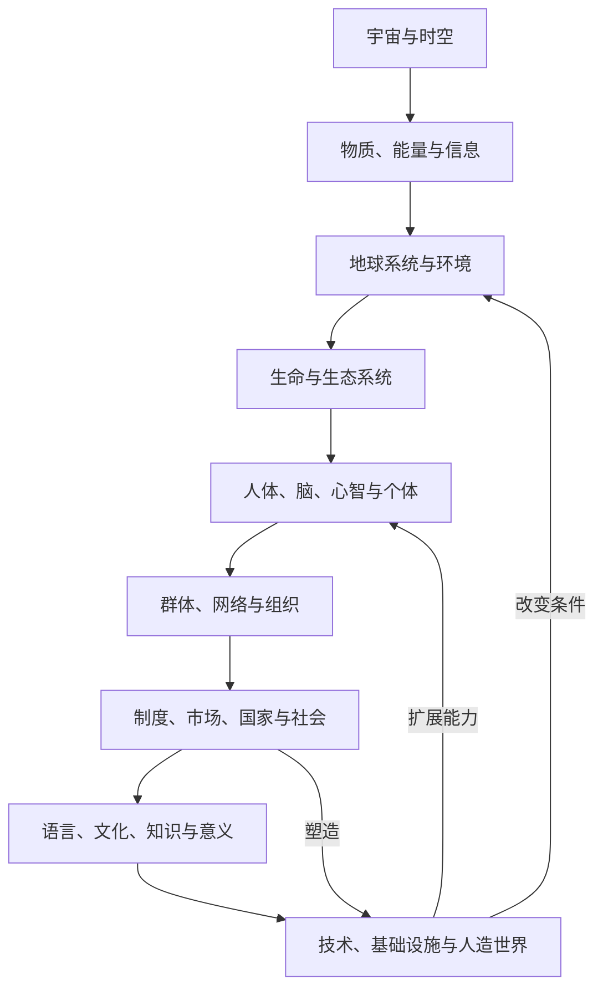

# 人类知识主地图 v0.1

## 1. 地图的读法

这张地图有三种同时成立的读法：

1. **纵向**：从 H0 到 H4 缩小知识范围；
2. **横向**：沿证据、解释、因果、依赖、应用、类比等关系跨领域移动；
3. **切面**：按对象、问题、方法、尺度、情境或学习目标重新投影。

因此这里的树是入口，不是世界只有一种分法的声明。

## 2. H0–H2 总图

```text
H0 Human Knowledge
│
├─ H1 S1 认识与形式表征
│  ├─ D01 元知识、哲学与探究
│  └─ D02 数学、统计与形式系统
│
├─ H1 S2 自然、生命与心智
│  ├─ D03 物质、能量与宇宙
│  ├─ D04 地球、空间与环境
│  ├─ D05 生命与进化
│  └─ D06 心智、脑与行为
│
├─ H1 S3 人类、社会与制度
│  ├─ D07 社会、人类与群体
│  ├─ D08 历史、考古与文明
│  ├─ D09 政治、治理与法律
│  ├─ D10 经济、金融与组织
│  └─ D11 语言、传播与媒体
│
├─ H1 S4 设计、技术与干预
│  ├─ D12 计算、信息与人工智能
│  ├─ D13 工程、技术与设计
│  ├─ D14 健康、医学与福祉
│  ├─ D15 农业、食物与生物生产
│  ├─ D16 教育、学习与发展
│  └─ D17 安全、冲突与韧性
│
└─ H1 S5 意义、表达与生活实践
   ├─ D18 艺术、文学与创造
   ├─ D19 宗教、意义与世界观
   └─ D20 日常生活、实践技能与自我管理
```

## 3. 为什么选择这五个超级领域

| H1 | 统一问题 | 主要认识方式 | 注意事项 |
|---|---|---|---|
| S1 认识与形式表征 | 什么算知识？怎样清晰表示、推理和量化？ | 反思、论证、演绎、形式化、统计推断 | 是其他领域的工具与批判层，不宣称脱离经验 |
| S2 自然、生命与心智 | 非人为与生物世界如何组成、变化和演化？ | 观察、实验、测量、机制解释、建模 | 心智也受文化塑造，因此与 S3 有大面积交叉 |
| S3 人类、社会与制度 | 人如何共同生活、形成历史、组织和规则？ | 统计、比较、历史、解释、制度与因果分析 | 不把社会规律误当成脱离情境的物理定律 |
| S4 设计、技术与干预 | 如何在约束下创造、维护、治疗、教导和保护？ | 设计、试验、优化、控制、评估、实践判断 | 以目标和价值为前提，不能只谈技术可行性 |
| S5 意义、表达与生活实践 | 人如何体验、表达、赋义并过好具体生活？ | 阐释、创作、批评、修习、具身实践 | 不因难以量化而降格，也不免于证据与批评 |

超级领域允许多重连接。例如数学既是独立形式知识，也是物理、计算、经济和工程的方法基础；教育既是社会制度，也是有目标的干预实践。

## 4. 现实对象地图

领域回答“从什么知识传统观察”，对象地图回答“被观察的是什么”。二者正交：



每个对象都可能由多个领域共同研究。比如“城市”同时是物质基础设施、生态系统、经济网络、治理制度、历史产物、文化空间和日常生活场所。

## 5. 人类认识活动地图

```text
发现差异 ─→ 命名与分类 ─→ 描述与测量 ─→ 比较与归纳
    │                                  │
    └────────→ 提出问题与假说 ←────────┘
                          │
             ┌────────────┼────────────┐
             ↓            ↓            ↓
          形式推导      经验检验      历史/意义解释
             └────────────┼────────────┘
                          ↓
                    理论与模型
                          ↓
              预测 / 评价 / 设计 / 决策
                          ↓
                  行动、反馈与修正
```

这个循环比“学科 → 知识点”更接近知识实际如何产生和使用。

## 6. 八类通用问题入口

| 问题类 | 核心形式 | 常调用的内容类型 |
|---|---|---|
| 描述/分类 | 它是什么？有哪些类型和状态？ | 概念、分类、测量、观察 |
| 解释/因果 | 为什么发生？机制是什么？ | 理论、因果模型、证据、历史过程 |
| 预测/预警 | 接下来可能怎样？概率多大？ | 数据、统计模型、仿真、情景 |
| 诊断/溯因 | 已知结果最可能由什么造成？ | 鉴别标准、贝叶斯更新、机制、案例 |
| 评价/规范 | 什么是好、对、公平或可接受？ | 价值、伦理、法律、权衡框架 |
| 设计/创造 | 如何使某物实现目标？ | 需求、约束、原型、设计原则 |
| 控制/优化 | 如何稳定、提高或分配？ | 反馈、控制、优化、激励、资源模型 |
| 决策/行动 | 在不确定和多目标下做什么？ | 预测、效用、风险、博弈、执行与学习 |

问题类型不会自动给出答案，但能决定应检索的关系与证据。

## 7. 高价值桥接区

以下不是新增 H2，而是下一阶段优先建立的跨领域 H3/主题图：

| 桥接区 | 连接的一级领域 | 共同核心 |
|---|---|---|
| 认知科学 | D01/D05/D06/D11/D12 | 表征、学习、推理、意识、语言与智能 |
| 复杂系统 | D02/D03/D05/D07/D10/D12/D13 | 非线性、反馈、涌现、网络、适应 |
| 气候与可持续性 | D03/D04/D05/D09/D10/D13/D15 | 地球系统、资源、风险、公平与转型 |
| 公共卫生 | D06/D07/D09/D10/D14/D16 | 人群风险、行为、制度、预防与公平 |
| 数据与因果科学 | D01/D02/D07/D10/D12/D14 | 测量、推断、机制、决策与复现 |
| 生物工程 | D05/D13/D14/D15 | 生物机制、设计、生产、安全与伦理 |
| 科学技术与社会 | D01/D08/D09/D10/D13/D19 | 知识制度、创新扩散、权力、价值与影响 |
| 人机交互 | D06/D11/D12/D13/D18 | 感知、交互、媒介、设计与体验 |
| 城市系统 | D04/D07/D08/D09/D10/D13/D20 | 空间、基础设施、治理、经济与生活 |
| 风险与韧性 | D02/D04/D09/D10/D13/D14/D17 | 不确定性、脆弱性、冗余、恢复与治理 |

## 8. 三个示例：怎样在图中移动

### 企业为什么失败

```text
D10 经济/金融/组织
  ├─ depends-on → D02 概率、统计、优化
  ├─ complements → D06 认知偏差、动机、群体行为
  ├─ complements → D07 网络、规范、组织结构
  ├─ constrains ← D09 法律、监管、产权与治理
  ├─ transforms ← D12/D13 信息系统与技术变化
  └─ contextualized-by → D08 历史路径与案例
```

### 新技术能否成功

```text
D13 工程可行性与物理约束
 + D12 计算/信息能力
 + D10 成本、市场、组织与融资
 + D09 法律、标准和公共政策
 + D06 用户认知与行为
 + D07 采用网络和社会规范
 + D17 安全与失效模式
 + D08 历史类比及其边界
```

### 一项社会政策有什么影响

```text
D09 政策、权利与执行
 + D10 激励、分配和宏观反馈
 + D07 群体、网络、不平等和制度
 + D06 决策行为与心理反应
 + D02 因果推断和不确定性
 + D08 历史路径与比较案例
 + D11 叙事、传播和公共理解
 + D17 风险、冲突和系统韧性
```

## 9. 下一层展开标准

每个 H2 领域下一阶段应产生：

- 5–12 个 H3 子领域；
- 10–30 个结构性骨架节点；
- 3–8 个核心问题模板；
- 主要理论、模型、方法与证据传统；
- 至少 5 条跨 H2 关系；
- 适用边界、争议和典型误用；
- S/A/B/C/D 学习优先级种子；
- 一条通识路线和若干专业路线入口。

只有同时满足覆盖、边界、关系和使用四项要求，才算完成一个领域，而不是“列出很多词”。
