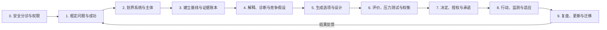

# 通用问题求解框架 / Universal Problem Solving Framework

> 本文件由 `08-data/frameworks.yaml` 生成。请修改数据源后运行 `python scripts/generate_views.py`。
> 版本：v0.7.0 · 节点：`hkm:framework:universal-problem-solving`

把二十类现实问题的共同操作内核组织为十阶段闭环，从安全分诊、框定和证据到选项、授权行动、监测与更新，并允许按风险与可逆性缩放流程。

## 进入框架前

1. 这是需要理解预测评价设计协商还是紧急响应的问题
2. 现在最小安全动作是什么
3. 谁拥有信息决定权执行能力和结果责任

## 全局结构

| 序号 | 透镜 / 阶段 | 目的 | 主要产物 |
|---:|---|---|---|
| 0 | 安全分诊与权限 Safety Triage and Authority | 在分析前识别紧急性、不可逆损害、专业责任和授权边界。 | 紧急性等级、临时保护措施、权限和升级接口。 |
| 1 | 框定问题与成功 Frame the Problem and Success | 把模糊诉求改写为有对象、目标、时间、价值、非目标和验收标准的问题契约。 | 版本化问题陈述与成功标准。 |
| 2 | 划界系统与主体 Scope the System and Stakeholders | 确定系统边界、尺度、状态变量、主体、约束、价值与外部性。 | 系统边界、主体、变量和价值图。 |
| 3 | 建立基线与证据账本 Build the Baseline and Evidence Ledger | 描述当前状态、数据生成过程、基准率、误差和关键未知。 | 基线、概率判断、证据质量和未知清单。 |
| 4 | 解释、诊断与竞争假设 Explain Diagnose and Compare Hypotheses | 构造多层原因、机制、反馈和竞争解释，并给出可区分预测。 | 竞争假设、因果图、可区分预测与反证。 |
| 5 | 生成选项与设计 Generate Options and Designs | 生成包括不行动、等待、信息购买、试点和结构性改变在内的多种可行选项。 | 至少三个结构不同的选项及不行动基线。 |
| 6 | 评价、压力测试与权衡 Evaluate Stress-test and Trade-off | 比较效果、成本、风险、公平、可逆性、激励反应和多情景稳健性。 | 多准则比较、情景敏感性、分配影响和失败预演。 |
| 7 | 决定、授权与承诺 Decide Authorize and Commit | 记录选择依据、责任、资源、权利保护、可逆点和不行动理由。 | 决策记录、授权责任、资源计划和撤销条件。 |
| 8 | 行动、监测与适应 Act Monitor and Adapt | 先以合适规模执行，监测领先和滞后指标，处理偏差并保护恢复能力。 | 实施协议、监测板、异常响应和恢复计划。 |
| 9 | 复盘、更新与迁移 Review Update and Transfer | 比较结果与反事实，更新判断，记录意外效应并决定扩展、修订、退出或升级。 | 结果审计、更新后的模型、迁移边界和下一轮问题。 |

## 按风险缩放，而不是机械走流程

| 情境 | 建议深度 | 不可删除的检查 |
|---|---|---|
| 低风险、可逆、影响局部 | 合并相邻阶段，保留一页记录 | 安全、目标、证据、不行动选项、监测与复盘 |
| 中等风险或多主体 | 完整十阶段，邀请不同视角审查 | 权限、受影响者、竞争解释、情景、撤销条件 |
| 高风险、不可逆或受监管 | 由合格专业和正式治理流程主导 | 紧急分诊、法定权限、独立审查、冗余、停止与升级 |

## 逐项调用

### 0. 安全分诊与权限 / Safety Triage and Authority

在分析前识别紧急性、不可逆损害、专业责任和授权边界。

**检查问题**

- 是否存在立即危害或强制报告义务
- 谁可以决定执行和停止
- 现在应先保护稳定还是收集更多信息

**领域入口：** D14 健康、医学与福祉 / D09 政治、治理与法律 / D17 安全、冲突与韧性 / D20 日常生活、实践技能与自我管理

**Thinking Models：** TM23 逆向思考与失败预演 / TM36 可逆与不可逆决策

**Universal Models：** UM17 风险、不确定性与可选性 / UM22 主体、激励与治理

**退出产物：** 紧急性等级、临时保护措施、权限和升级接口。

### 1. 框定问题与成功 / Frame the Problem and Success

把模糊诉求改写为有对象、目标、时间、价值、非目标和验收标准的问题契约。

**检查问题**

- 需要改变什么而不是先采用什么方案
- 对谁在何时算成功
- 哪些结果明确不可接受

**领域入口：** D01 元知识、哲学与探究 / D11 语言、传播与媒体 / D19 宗教、意义与世界观

**Thinking Models：** TM01 第一性原理与基本约束分解 / TM29 地图不等于领土与模型边界

**Universal Models：** UM06 信息、信号与表征

**退出产物：** 版本化问题陈述与成功标准。

### 2. 划界系统与主体 / Scope the System and Stakeholders

确定系统边界、尺度、状态变量、主体、约束、价值与外部性。

**检查问题**

- 边界内外有哪些对象流和主体
- 不同尺度与时间窗怎样改变答案
- 谁受影响却没有发言或退出能力

**领域入口：** D07 社会、人类与群体 / D04 地球、空间与环境 / D10 经济、金融与组织

**Thinking Models：** TM05 系统思维与边界建模 / TM40 视角转换、语境化与反思性解释

**Universal Models：** UM01 存量、流量与守恒 / UM22 主体、激励与治理

**退出产物：** 系统边界、主体、变量和价值图。

### 3. 建立基线与证据账本 / Build the Baseline and Evidence Ledger

描述当前状态、数据生成过程、基准率、误差和关键未知。

**检查问题**

- 什么证据支持当前状态和趋势
- 测量采样与选择偏差在哪里
- 哪些信息值得先购买或试验获得

**领域入口：** D02 数学、统计与形式系统 / D12 计算、信息与人工智能 / D08 历史、考古与文明

**Thinking Models：** TM03 概率思维与分布判断 / TM04 贝叶斯更新与证据权重 / TM30 基准率与参考类预测 / TM22 选择偏差与幸存者偏差

**Universal Models：** UM21 测量、观察与推断

**退出产物：** 基线、概率判断、证据质量和未知清单。

### 4. 解释、诊断与竞争假设 / Explain Diagnose and Compare Hypotheses

构造多层原因、机制、反馈和竞争解释，并给出可区分预测。

**检查问题**

- 哪些机制足以产生观察结果
- 共同原因反馈和延迟是什么
- 哪个新观察最能区分竞争解释

**领域入口：** D03 物质、能量与宇宙 / D05 生命与进化 / D06 心智、脑与行为

**Thinking Models：** TM02 因果与机制推理 / TM06 反馈回路与控制思维 / TM19 涌现与多层解释

**Universal Models：** UM02 反馈、调节与控制 / UM13 非线性、阈值与状态转换 / UM14 涌现、多尺度与组织

**退出产物：** 竞争假设、因果图、可区分预测与反证。

### 5. 生成选项与设计 / Generate Options and Designs

生成包括不行动、等待、信息购买、试点和结构性改变在内的多种可行选项。

**检查问题**

- 若不能采用默认方案还有什么路径
- 哪些约束可以移除绕过或重新设计
- 如何保留可选性并让行动产生信息

**领域入口：** D13 工程、技术与设计 / D18 艺术、文学与创造 / D15 农业、食物与生物生产

**Thinking Models：** TM24 约束理论与瓶颈 / TM26 可选性与实物期权 / TM41 发散、收敛与创造性迭代

**Universal Models：** UM07 约束、瓶颈与可行性 / UM18 优化、搜索与学习

**退出产物：** 至少三个结构不同的选项及不行动基线。

### 6. 评价、压力测试与权衡 / Evaluate Stress-test and Trade-off

比较效果、成本、风险、公平、可逆性、激励反应和多情景稳健性。

**检查问题**

- 关键结果对哪些假设最敏感
- 短长期和不同群体代价如何分布
- 失败预演会暴露哪些共同原因风险

**领域入口：** D10 经济、金融与组织 / D09 政治、治理与法律 / D17 安全、冲突与韧性

**Thinking Models：** TM07 二阶效应与后果链 / TM10 激励与机制设计 / TM23 逆向思考与失败预演 / TM35 情景、敏感性与稳健决策 / TM37 权衡与可行前沿

**Universal Models：** UM08 资源配置、权衡与机会成本 / UM19 路径依赖、递增收益与锁定 / UM20 韧性、冗余与恢复

**退出产物：** 多准则比较、情景敏感性、分配影响和失败预演。

### 7. 决定、授权与承诺 / Decide Authorize and Commit

记录选择依据、责任、资源、权利保护、可逆点和不行动理由。

**检查问题**

- 由谁依据什么标准作出决定
- 哪些前提是承诺哪些仍是待验证假设
- 何时可以撤销暂停或转向

**领域入口：** D09 政治、治理与法律 / D10 经济、金融与组织 / D20 日常生活、实践技能与自我管理

**Thinking Models：** TM09 机会成本 / TM11 策略互动与博弈论 / TM36 可逆与不可逆决策

**Universal Models：** UM05 竞争、合作与协调 / UM22 主体、激励与治理

**退出产物：** 决策记录、授权责任、资源计划和撤销条件。

### 8. 行动、监测与适应 / Act Monitor and Adapt

先以合适规模执行，监测领先和滞后指标，处理偏差并保护恢复能力。

**检查问题**

- 最小可学习且安全的行动是什么
- 哪些指标能提前发现偏离和伤害
- 反馈延迟或执行漂移时如何调整

**领域入口：** D13 工程、技术与设计 / D16 教育、学习与发展 / D14 健康、医学与福祉

**Thinking Models：** TM34 实验、迭代与可学习行动 / TM27 冗余、缓冲与安全余量 / TM28 稳健性、韧性与反脆弱

**Universal Models：** UM02 反馈、调节与控制 / UM18 优化、搜索与学习 / UM20 韧性、冗余与恢复

**退出产物：** 实施协议、监测板、异常响应和恢复计划。

### 9. 复盘、更新与迁移 / Review Update and Transfer

比较结果与反事实，更新判断，记录意外效应并决定扩展、修订、退出或升级。

**检查问题**

- 结果相对基线和替代方案如何
- 什么证据改变了原有判断
- 哪些机制可迁移哪些只适用于当前语境

**领域入口：** D08 历史、考古与文明 / D16 教育、学习与发展 / D11 语言、传播与媒体

**Thinking Models：** TM04 贝叶斯更新与证据权重 / TM34 实验、迭代与可学习行动 / TM29 地图不等于领土与模型边界

**Universal Models：** UM21 测量、观察与推断 / UM16 复制、传播与记忆

**退出产物：** 结果审计、更新后的模型、迁移边界和下一轮问题。

## 质量门

- 安全与授权门
- 证据充分性门
- 竞争解释门
- 可行性与权衡门
- 决策责任门
- 行动监测门
- 结果更新门

## 完整输出

- 问题与权限契约
- 系统和证据账本
- 竞争解释
- 选项与压力测试
- 决策记录
- 实施监测与更新档案

## 停止与升级

- 存在紧急危险或不可逆伤害
- 需要受监管专业判断或法定权限
- 关键利益相关者无法代表或同意
- 证据不足以支持高风险行动
- 执行结果越过预设停止阈值

## 边界

框架不能保证正确答案，也不能替代领域资格、参与式治理或价值判断。流程深度应随风险、不可逆性、影响规模和证据不足增加；低风险可逆问题可以合并阶段，但安全、证据、反证、责任和更新不可删除。
