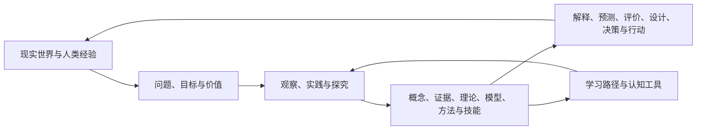
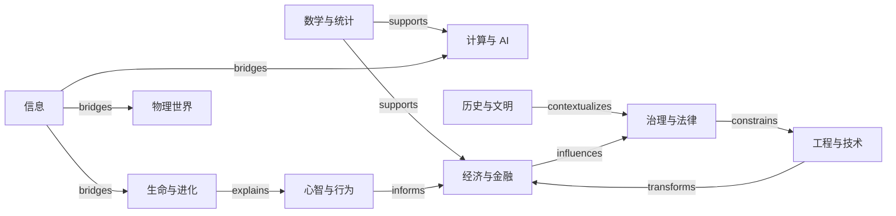
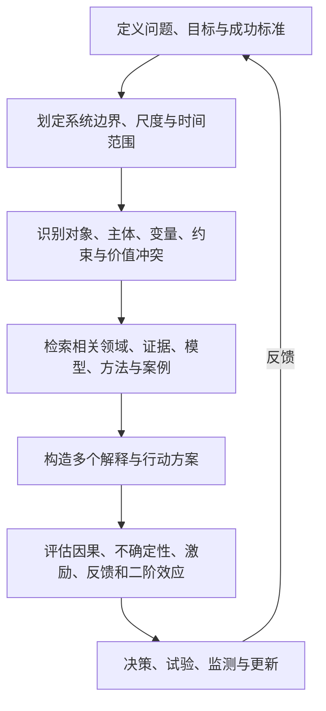

# Human Knowledge Model

> 一张描述“人类如何认识世界、形成知识并用知识行动”的可扩展地图。

**交互网站：** [xxiaoxiong.github.io/human-knowledge-model](https://xxiaoxiong.github.io/human-knowledge-model/) · **源代码：** [GitHub](https://github.com/xxiaoxiong/human-knowledge-model)

本项目不是百科全书，也不是把所有学科排成一棵树。它把人类知识建模为一个**有主导航、可多重归属的类型化知识图谱**：树负责让人找到入口，图负责保留真实关系，多维坐标负责按对象、问题、方法、尺度和用途重新切片。

当前版本已完成总体架构、Ontology、分类原则和知识地图，并冻结 v0.2.0 的 248 个 H3 子领域、10 个跨域桥接视图及 80 条外部分类 crosswalk；v0.3.0 的 257 个领域骨架节点；v0.4.0 的 41 个 Thinking Models 与 22 个 Universal Models；v0.5.0 的 20 个 Problem → Knowledge 问题原型；v0.6.0 的 320 项个人核心知识排名与八单元学习路线；v0.7.0 的多维思考与通用问题求解框架；以及 v0.8.0 的全局结构审计。当前总图谱包含 635 个正式节点和 3,056 条关系。

## 一眼看懂整个模型



模型由五个互相连接的平面组成：

| 平面 | 回答的问题 | 主要节点 |
|---|---|---|
| 世界（World） | 知识关于什么？ | 对象、过程、系统、主体、事件、尺度、情境 |
| 知识（Knowledge） | 人类形成了什么认识？ | 概念、命题、证据、理论、模型、规范 |
| 探究（Inquiry） | 这些认识如何产生与检验？ | 问题、观察、实验、推理、测量、比较、仿真 |
| 行动（Action） | 知识如何改变现实？ | 方法、工具、技术、技能、设计、干预、决策 |
| 学习（Learning） | 一个人应以什么顺序掌握？ | 前置关系、难度、优先级、迁移价值、学习路径 |

### 主导航不是唯一真相

```text
H0  Human Knowledge
│
├─ H1 认识与形式表征
├─ H1 自然、生命与心智
├─ H1 人类、社会与制度
├─ H1 设计、技术与干预
└─ H1 意义、表达与生活实践
     │
     └─ H2 20 个一级知识领域
          │
          └─ H3 子领域 → H4 主题 / 问题簇

与范围层级正交的内容节点：
概念 / 现象 / 命题 / 证据 / 理论 / 模型 / 方法 / 工具 /
技术 / 技能 / 规范 / 案例 / 问题
```

“理论、模型、概念、方法、工具”不是机械相邻的目录层级，而是不同节点类型。一个模型可以抽象多个领域，一个方法可以被许多理论使用，一个工具也可以实现多个方法。把它们强制塞进同一条树会制造错误关系。

## 一级知识地图

| 超级领域 | 一级领域 |
|---|---|
| 认识与形式表征 | 元知识、哲学与探究；数学、统计与形式系统 |
| 自然、生命与心智 | 物质、能量与宇宙；地球、空间与环境；生命与进化；心智、脑与行为 |
| 人类、社会与制度 | 社会、人类与群体；历史、考古与文明；政治、治理与法律；经济、金融与组织；语言、传播与媒体 |
| 设计、技术与干预 | 计算、信息与人工智能；工程、技术与设计；健康、医学与福祉；农业、食物与生物生产；教育、学习与发展；安全、冲突与韧性 |
| 意义、表达与生活实践 | 艺术、文学与创造；宗教、意义与世界观；日常生活、实践技能与自我管理 |

这 20 个领域是**稳定入口**，不是互斥容器。例如，认知科学可同时连接心智、计算、生命、语言与哲学；气候变化同时连接地球、经济、政治、工程、健康与伦理。每个节点只有一个稳定 ID，但可以有多个领域归属和任意数量的有类型关系。

详见[一级领域说明](01-knowledge-map/level-1-domains.md)、[H1–H3 完整范围地图](01-knowledge-map/level-2-3-map.generated.md)、[跨领域桥接视图](01-knowledge-map/bridge-views.generated.md)和[完整主地图](01-knowledge-map/human-knowledge-map.md)。

## 知识如何横向连接



关系不是随意的 `related-to` 标签。模型区分范围、分类、组成、依赖、证据、解释、因果、实现、应用、学习与类比关系，并为边保留方向、语境、置信度和来源。详见[Ontology](00-meta/ontology.md)与[领域关系](01-knowledge-map/domain-relations.md)。

## 最重要的跨学科模型

41 个 Thinking Models 是可执行的认知操作，22 个 Universal Models 是跨领域重复出现的世界结构。两者必须成对使用：例如“系统思维”是观察动作，“反馈、调节与控制”是被观察的结构。

| 模型簇 | Thinking Models 示例 | Universal Models 示例 | 主要用途 |
|---|---|---|---|
| 证据与因果 | 因果机制、概率、贝叶斯更新、基准率 | 测量—观察—推断、信息—信号—表征 | 描述未知、比较解释、校准主张 |
| 系统与动力学 | 系统边界、反馈、二阶效应、阈值、瓶颈 | 存量流量、反馈控制、约束、非线性、韧性 | 理解复杂系统、失效和恢复 |
| 主体与决策 | 机会成本、激励、博弈、情景、可逆性、权衡前沿 | 资源配置、风险可选性、主体激励治理 | 比较选项、预测策略反应、承担责任 |
| 网络、进化与涌现 | 选择、网络效应、厚尾、多层解释 | 网络传播、变异选择、涌现多尺度 | 解释扩散、适应、集中和宏观模式 |
| 学习、创造与边界 | 失败预演、模型边界、实验迭代、视角转换、发散收敛 | 优化搜索学习、复制传播记忆 | 生成方案、主动反证、迁移并更新 |

每个模型均保留来源领域、机制锚点、适用问题、案例、反例、误用和边界。完整内容见[Thinking Models](03-thinking-models/thinking-models.generated.md)与[Universal Models](04-universal-models/universal-models.generated.md)。

## 多维知识坐标

任何重要节点都可以沿以下维度定位：

```text
知识节点 =
  主领域 × 现实对象 × 问题/目的 × 知识形态 × 探究方法
  × 尺度 × 时间/空间情境 × 认识状态 × 应用场景 × 学习价值
```

因此，同一张图可以生成不同视图：

- 按学科学习：概率论 → 统计推断 → 因果推断；
- 按现实对象理解：个体 → 组织 → 市场 → 国家；
- 按问题调用：预测、诊断、设计、决策、评价；
- 按方法迁移：实验、建模、历史比较、仿真、设计迭代；
- 按个人价值排序：S/A/B/C/D 学习优先级。

详见[多维坐标系](01-knowledge-map/multidimensional-coordinate-system.md)。

## 普通人最应该学习什么？

没有脱离目标与语境的唯一课程表，但存在一个值得优先建立的共同底座：知道模型有边界；能用概率、证据和测量表达未知；能看见机会成本、激励、反馈、约束与二阶效应；能学习、沟通并理解历史与制度；能在健康、安全和专业责任边界内行动。

项目把 257 个领域骨架、41 个 Thinking Models 和 22 个 Universal Models 组成 320 项可审计候选，并提供三个嵌套入口：

- **Top 50：共同底座。** 28 个领域骨架覆盖全部 20 个 H2，配合 14 个思维模型和 8 个通用模型；目标是形成安全、证据、决策、系统、学习与意义的基本操作能力。
- **Top 100：通识广度。** 每个 H2 至少两个骨架入口，加入更多领域机制与模型；适合在共同底座后按薄弱领域扩展。
- **Top 300：长期网络。** 围绕现实项目分批学习，不按名次机械背诵；每轮都回连前置、问题模板与已有作品。

八阶段路线依次组织为：定位与安全 → 概率与证据 → 决策与激励 → 系统与韧性 → 学习与互动 → 社会与意义 → 设计与健康安全 → 跨域综合。每个阶段都用练习、作品和迁移证据验收，而不是用阅读数量代替掌握。

完整排名、得分组成和入选理由见[个人核心知识 Top 50 / 100 / 300](06-learning/core-knowledge.generated.md)；前置、分支和阶段作品见[个人核心知识螺旋学习路线](06-learning/learning-roadmap.generated.md)。这份排序是有限时间下的覆盖组合，不是学术、文化、职业或个人价值等级；权重、问题模板和个人语境变化时应重新生成或调整路线。

## 怎样用它学习

1. 从[一级知识地图](01-knowledge-map/level-1-domains.md)建立全局定位感。
2. 选择一个现实问题，而不是孤立地选一门课。
3. 沿 `requires` 与 `prerequisite-of` 补齐前置知识。
4. 用领域骨架掌握 10–30 个结构性节点，再进入细节。
5. 沿 `explains`、`analogous-to`、`applies-to` 主动建立迁移。
6. 用学习优先级决定深度，而不是把所有节点学到同一程度。

## 怎样用它解决现实问题



这条流程现已由 20 个 `Problem → Knowledge Mapping` 原型具体化：每个原型都给出问题边界、H2 与骨架调用、Thinking / Universal Models、证据门槛、五步工作流、失效模式和专业升级条件。详见[问题—知识调用体系](05-problem-mapping/problem-templates.generated.md)。

当问题仍然模糊时，先用[多维思考框架](07-frameworks/multidimensional-thinking-framework.md)的十个透镜扫描遗漏；当需要从判断进入行动时，使用[通用问题求解框架](07-frameworks/universal-problem-solving-framework.md)的十阶段闭环。流程按风险和可逆性缩放：低风险问题可以合并阶段，高风险、不可逆或受监管问题必须提高证据、授权、监督与升级要求。

## 怎样扩展而不破坏结构

新增内容时遵循四步：

1. **先复用身份**：搜索是否已有同一概念，避免按文件重复建点。
2. **先判类型**：它是领域、问题、概念、理论、模型、方法、工具、技能还是案例？
3. **再定位范围**：指定主归属，并添加必要的次级领域与多维标签。
4. **最后连边**：至少说明它依赖什么、解释/实现/应用于什么，以及边的来源和适用语境。

只有范围节点使用 H0–H4；不要因为内容更“具体”就把方法、工具或应用误当成固定的 H6/H7。具体规范见[分类原则](00-meta/classification-principles.md)。

## 全局审计与演化边界

v0.8.0 对全部 635 个正式节点和 3,056 条关系执行了独立审计：没有孤立节点、悬空引用、自环、重复有向关系、同层歧义标签或重复定义；整张图是一个弱连通分量。全部 248 个 H3 都被领域骨架覆盖，20 个 H2 都进入模型、问题、Top 50 和两套操作框架，41 个 Thinking Models 与 22 个 Universal Models 均被问题模板调用。

审计同时修复了 283 个未正确引用的 YAML 双语标签，并把“必须且只能包含非空 `zh` / `en`”加入验证门。保留 79 组 H3 范围与骨架节点同名：前者是分类范围，后者是可调用内容身份，ID 和定义不同，不属于重复建点。

这不等于知识已经穷尽。Crosswalk 证明外部领域存在入口，不证明所有 H4 和具体知识都已展开；语义近义、地方知识、隐性实践和新兴领域仍需要持续编辑审查。完整指标、逐领域矩阵与拆分/合并决定见[Phase 8 全局结构审计](00-meta/phase-8-global-audit.generated.md)。

## 项目结构与状态

```text
human-knowledge-model/
├─ .github/workflows/pages.yml
├─ README.md
├─ 00-meta/
│  ├─ knowledge-model-design.md
│  ├─ ontology.md
│  ├─ classification-principles.md
│  ├─ source-taxonomy-review.md
│  ├─ phase-1-audit.md
│  ├─ h3-structure-pressure-test.md
│  ├─ phase-2b-audit.md
│  ├─ core-skeleton-design.md
│  ├─ phase-3-progress-audit.md
│  ├─ cross-disciplinary-model-design.md
│  ├─ phase-4-audit.md
│  ├─ problem-mapping-design.md
│  ├─ phase-5-audit.md
│  ├─ learning-priority-design.md
│  ├─ phase-6-audit.md
│  ├─ phase-7-audit.md
│  └─ phase-8-global-audit.generated.md
├─ 01-knowledge-map/
│  ├─ human-knowledge-map.md
│  ├─ level-1-domains.md
│  ├─ domain-relations.md
│  ├─ multidimensional-coordinate-system.md
│  ├─ level-2-3-map.generated.md
│  ├─ bridge-views.generated.md
│  └─ external-crosswalk.generated.md
├─ 02-domain-skeletons/
│  └─ template-domain-skeletons.generated.md
├─ 03-thinking-models/
│  └─ thinking-models.generated.md
├─ 04-universal-models/
│  └─ universal-models.generated.md
├─ 05-problem-mapping/
│  └─ problem-templates.generated.md
├─ 06-learning/
│  ├─ core-knowledge.generated.md
│  └─ learning-roadmap.generated.md
├─ 07-frameworks/
│  ├─ multidimensional-thinking-framework.md
│  └─ universal-problem-solving-framework.md
├─ 08-data/
│  ├─ schema.yaml
│  ├─ domains.yaml
│  ├─ subdomains.yaml
│  ├─ bridges.yaml
│  ├─ core-nodes.yaml
│  ├─ thinking-models.yaml
│  ├─ universal-models.yaml
│  ├─ problem-templates.yaml
│  ├─ learning-roadmap.yaml
│  ├─ learning-priorities.generated.yaml
│  ├─ frameworks.yaml
│  ├─ relationships.yaml
│  ├─ hierarchy-relationships.generated.yaml
│  ├─ bridge-relationships.generated.yaml
│  ├─ core-relationships.generated.yaml
│  ├─ model-relationships.generated.yaml
│  ├─ problem-relationships.generated.yaml
│  ├─ learning-relationships.generated.yaml
│  ├─ framework-relationships.generated.yaml
│  ├─ global-audit.generated.yaml
│  └─ crosswalks.yaml
├─ site/
│  ├─ index.html
│  ├─ styles.css
│  ├─ app.js
│  └─ og.png
└─ scripts/
   ├─ build_site.py
   ├─ audit_graph.py
   ├─ generate_learning.py
   ├─ generate_frameworks.py
   ├─ generate_views.py
   ├─ normalize_inline_labels.py
   ├─ validate.py
   └─ validate_site.py
```

运行以下命令可重建和验证知识图谱及静态网站：

```powershell
python scripts/generate_views.py
python scripts/validate.py
python scripts/build_site.py
python scripts/validate_site.py
```

推送到 `main` 后，GitHub Actions 会重复同一组校验并把 `dist-site/` 发布到 GitHub Pages。网站使用仓库相对路径，可直接挂载在项目 Website 地址下。

| 阶段 | 状态 | 交付物 |
|---|---|---|
| 1. 总体设计 | **已完成 v0.1** | 架构、Ontology、分类原则、源分类比较 |
| 2a. 一级地图 | **已完成 v0.1** | H1 超级领域、20 个 H2 一级领域、跨域种子关系 |
| 2b. 二/三级地图 | **已完成 v0.2.0** | 248 个 H3、10 个桥接视图、80 条外部 crosswalk、冻结审计 |
| 3. 领域骨架 | **已完成 v0.3.0** | 20 个领域共 257 个节点、1,271 条骨架关系；H3 全覆盖、前置无环、冻结审计 |
| 4. 跨学科模型 | **已完成 v0.4.0** | 41 个 Thinking Models、22 个 Universal Models、530 条模型关系；全域覆盖、边界与反例审计 |
| 5. 问题映射 | **已完成 v0.5.0** | 20 个问题原型、463 条调用关系；全域/全模型覆盖、证据门槛、工作流与升级边界 |
| 6. 学习体系 | **已完成 v0.6.0** | 320 项候选与 Top 50/100/300；8 个学习单元、3 个层级循环、4 条分支路线、109 条学习关系 |
| 7. 求解框架 | **已完成 v0.7.0** | 2 个操作框架、20 个透镜/阶段、161 条调用关系；20 个 H2 与 20 个问题原型覆盖 |
| 8. 全局审计 | **已完成 v0.8.0** | 635 节点 / 3,056 关系；单一弱连通分量、0 阻断项；双语标签重构、覆盖矩阵与拆分/合并决定 |

## 设计底线

```text
结构 > 数量       关系 > 罗列       模型 > 零散知识点
理解 > 记忆       迁移 > 学科边界   可证伪 > 权威口号
显式边界 > 假装完备               可持续演化 > 一次性目录
```

版本：`0.2.0`（冻结范围地图） / `0.3.0`（冻结领域骨架） / `0.4.0`（冻结跨学科模型） / `0.5.0`（冻结问题映射） / `0.6.0`（冻结学习体系） / `0.7.0`（冻结认知操作框架） / `0.8.0`（全局结构审计）
