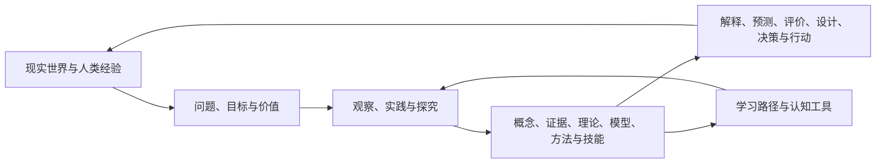
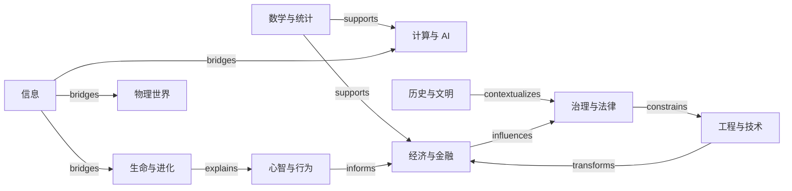
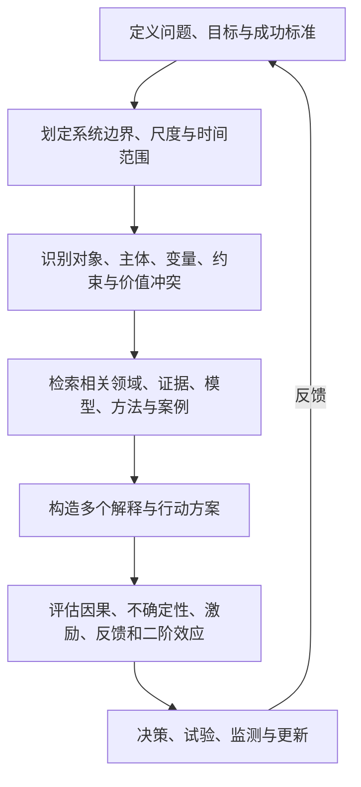

# Human Knowledge Model

> 一张描述“人类如何认识世界、形成知识并用知识行动”的可扩展地图。

**交互网站：** [xxiaoxiong.github.io/human-knowledge-model](https://xxiaoxiong.github.io/human-knowledge-model/) · **源代码：** [GitHub](https://github.com/xxiaoxiong/human-knowledge-model)

本项目不是百科全书，也不是把所有学科排成一棵树。它把人类知识建模为一个**有主导航、可多重归属的类型化知识图谱**：树负责让人找到入口，图负责保留真实关系，多维坐标负责按对象、问题、方法、尺度和用途重新切片。

当前版本已完成总体架构、Ontology、分类原则、一级知识地图，并冻结 v0.2.0 的 248 个 H3 子领域、10 个跨域桥接视图及 80 条外部分类 crosswalk。阶段 3 已冻结全部 20 个领域的 257 个核心骨架节点和 1,271 条生成关系；思维模型库、问题映射与通用求解框架将在此基础上展开。

## 一眼看懂整个模型



模型由五个互相连接的平面组成：

| 平面 | 回答的问题 | 主要节点 |
|---|---|---|
| 世界（World） | 知识关于什么？ | 对象、过程、系统、主体、事件、尺度、情境 |
| 知识（Knowledge） | 人类形成了什么认识？ | 概念、命题、证据、理论、模型、规范 |
| 探究（Inquiry） | 这些认识如何产生与检验？ | 问题、观察、实验、推理、测量、比较、仿真 |
| 行动（Action） | 知识如何改变现实？ | 方法、工具、技术、技能、设计、干预、决策 |
| 学习（Learning） | 一个人应以什么顺序掌握？ | 前置关系、难度、优先级、迁移价值、学习路径 |

### 主导航不是唯一真相

```text
H0  Human Knowledge
│
├─ H1 认识与形式表征
├─ H1 自然、生命与心智
├─ H1 人类、社会与制度
├─ H1 设计、技术与干预
└─ H1 意义、表达与生活实践
     │
     └─ H2 20 个一级知识领域
          │
          └─ H3 子领域 → H4 主题 / 问题簇

与范围层级正交的内容节点：
概念 / 现象 / 命题 / 证据 / 理论 / 模型 / 方法 / 工具 /
技术 / 技能 / 规范 / 案例 / 问题
```

“理论、模型、概念、方法、工具”不是机械相邻的目录层级，而是不同节点类型。一个模型可以抽象多个领域，一个方法可以被许多理论使用，一个工具也可以实现多个方法。把它们强制塞进同一条树会制造错误关系。

## 一级知识地图

| 超级领域 | 一级领域 |
|---|---|
| 认识与形式表征 | 元知识、哲学与探究；数学、统计与形式系统 |
| 自然、生命与心智 | 物质、能量与宇宙；地球、空间与环境；生命与进化；心智、脑与行为 |
| 人类、社会与制度 | 社会、人类与群体；历史、考古与文明；政治、治理与法律；经济、金融与组织；语言、传播与媒体 |
| 设计、技术与干预 | 计算、信息与人工智能；工程、技术与设计；健康、医学与福祉；农业、食物与生物生产；教育、学习与发展；安全、冲突与韧性 |
| 意义、表达与生活实践 | 艺术、文学与创造；宗教、意义与世界观；日常生活、实践技能与自我管理 |

这 20 个领域是**稳定入口**，不是互斥容器。例如，认知科学可同时连接心智、计算、生命、语言与哲学；气候变化同时连接地球、经济、政治、工程、健康与伦理。每个节点只有一个稳定 ID，但可以有多个领域归属和任意数量的有类型关系。

详见[一级领域说明](01-knowledge-map/level-1-domains.md)、[H1–H3 完整范围地图](01-knowledge-map/level-2-3-map.generated.md)、[跨领域桥接视图](01-knowledge-map/bridge-views.generated.md)和[完整主地图](01-knowledge-map/human-knowledge-map.md)。

## 知识如何横向连接



关系不是随意的 `related-to` 标签。模型区分范围、分类、组成、依赖、证据、解释、因果、实现、应用、学习与类比关系，并为边保留方向、语境、置信度和来源。详见[Ontology](00-meta/ontology.md)与[领域关系](01-knowledge-map/domain-relations.md)。

## 多维知识坐标

任何重要节点都可以沿以下维度定位：

```text
知识节点 =
  主领域 × 现实对象 × 问题/目的 × 知识形态 × 探究方法
  × 尺度 × 时间/空间情境 × 认识状态 × 应用场景 × 学习价值
```

因此，同一张图可以生成不同视图：

- 按学科学习：概率论 → 统计推断 → 因果推断；
- 按现实对象理解：个体 → 组织 → 市场 → 国家；
- 按问题调用：预测、诊断、设计、决策、评价；
- 按方法迁移：实验、建模、历史比较、仿真、设计迭代；
- 按个人价值排序：S/A/B/C/D 学习优先级。

详见[多维坐标系](01-knowledge-map/multidimensional-coordinate-system.md)。

## 怎样用它学习

1. 从[一级知识地图](01-knowledge-map/level-1-domains.md)建立全局定位感。
2. 选择一个现实问题，而不是孤立地选一门课。
3. 沿 `requires` 与 `prerequisite-of` 补齐前置知识。
4. 用领域骨架掌握 10–30 个结构性节点，再进入细节。
5. 沿 `explains`、`analogous-to`、`applies-to` 主动建立迁移。
6. 用学习优先级决定深度，而不是把所有节点学到同一程度。

## 怎样用它解决现实问题



后续阶段会把这条流程发展为 `Problem → Knowledge Mapping` 与 Universal Problem Solving Framework。当前结构已为问题、方法、领域和模型之间的可计算映射预留节点与关系。

## 怎样扩展而不破坏结构

新增内容时遵循四步：

1. **先复用身份**：搜索是否已有同一概念，避免按文件重复建点。
2. **先判类型**：它是领域、问题、概念、理论、模型、方法、工具、技能还是案例？
3. **再定位范围**：指定主归属，并添加必要的次级领域与多维标签。
4. **最后连边**：至少说明它依赖什么、解释/实现/应用于什么，以及边的来源和适用语境。

只有范围节点使用 H0–H4；不要因为内容更“具体”就把方法、工具或应用误当成固定的 H6/H7。具体规范见[分类原则](00-meta/classification-principles.md)。

## 项目结构与状态

```text
human-knowledge-model/
├─ .github/workflows/pages.yml
├─ README.md
├─ 00-meta/
│  ├─ knowledge-model-design.md
│  ├─ ontology.md
│  ├─ classification-principles.md
│  ├─ source-taxonomy-review.md
│  ├─ phase-1-audit.md
│  ├─ h3-structure-pressure-test.md
│  ├─ phase-2b-audit.md
│  ├─ core-skeleton-design.md
│  └─ phase-3-progress-audit.md
├─ 01-knowledge-map/
│  ├─ human-knowledge-map.md
│  ├─ level-1-domains.md
│  ├─ domain-relations.md
│  ├─ multidimensional-coordinate-system.md
│  ├─ level-2-3-map.generated.md
│  ├─ bridge-views.generated.md
│  └─ external-crosswalk.generated.md
├─ 02-domain-skeletons/
│  └─ template-domain-skeletons.generated.md
├─ 08-data/
│  ├─ schema.yaml
│  ├─ domains.yaml
│  ├─ subdomains.yaml
│  ├─ bridges.yaml
│  ├─ core-nodes.yaml
│  ├─ relationships.yaml
│  ├─ hierarchy-relationships.generated.yaml
│  ├─ bridge-relationships.generated.yaml
│  ├─ core-relationships.generated.yaml
│  └─ crosswalks.yaml
├─ site/
│  ├─ index.html
│  ├─ styles.css
│  ├─ app.js
│  └─ og.png
└─ scripts/
   ├─ build_site.py
   ├─ generate_views.py
   ├─ validate.py
   └─ validate_site.py
```

运行以下命令可重建和验证知识图谱及静态网站：

```powershell
python scripts/generate_views.py
python scripts/validate.py
python scripts/build_site.py
python scripts/validate_site.py
```

推送到 `main` 后，GitHub Actions 会重复同一组校验并把 `dist-site/` 发布到 GitHub Pages。网站使用仓库相对路径，可直接挂载在项目 Website 地址下。

| 阶段 | 状态 | 交付物 |
|---|---|---|
| 1. 总体设计 | **已完成 v0.1** | 架构、Ontology、分类原则、源分类比较 |
| 2a. 一级地图 | **已完成 v0.1** | H1 超级领域、20 个 H2 一级领域、跨域种子关系 |
| 2b. 二/三级地图 | **已完成 v0.2.0** | 248 个 H3、10 个桥接视图、80 条外部 crosswalk、冻结审计 |
| 3. 领域骨架 | **已完成 v0.3.0** | 20 个领域共 257 个节点、1,271 条骨架关系；H3 全覆盖、前置无环、冻结审计 |
| 4. 跨学科模型 | 待展开 | Thinking Models、Universal Models |
| 5. 问题映射 | 待展开 | Problem → Knowledge Mapping |
| 6. 学习体系 | 待展开 | 核心知识、优先级、前置关系、路线 |
| 7. 求解框架 | 待展开 | 多维思考与通用问题求解框架 |
| 8. 全局审计 | 待展开 | 遗漏、重复、错层、断边与重构报告 |

## 设计底线

```text
结构 > 数量       关系 > 罗列       模型 > 零散知识点
理解 > 记忆       迁移 > 学科边界   可证伪 > 权威口号
显式边界 > 假装完备               可持续演化 > 一次性目录
```

版本：`0.2.0`（冻结范围地图） / `0.3.0`（冻结领域骨架）
